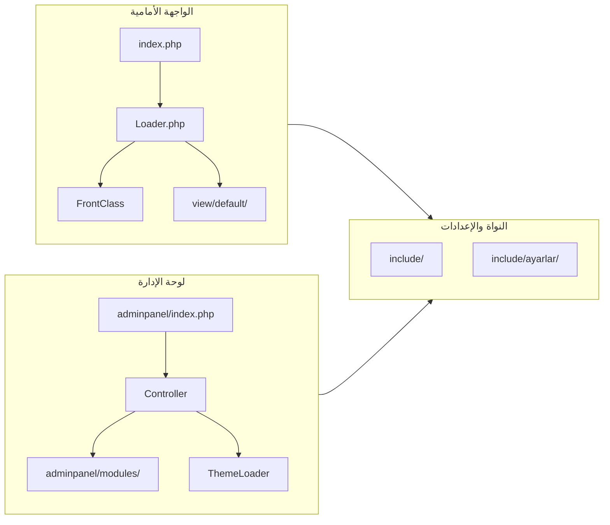

# فهم مشروع webratik-cms بشكل عام

مرجع تقني واحد لهيكل المشروع ونقاط الدخول والتوجيه والإعدادات. يُحدَّث عند إضافة نقاط دخول أو تغيير الاصطلاحات.

## نوع المشروع والتقنيات

- **نوع المشروع:** نظام إدارة محتوى (CMS) مخصص بلغة PHP (ليس WordPress أو Drupal).
- **التقنيات الأساسية:**
  - **PHP** مع استخدام Namespace `AdminPanel\` في لوحة الإدارة.
  - **Composer** لإدارة الحزم (PHPMailer, Dwoo, Doctrine DBAL/Migrations, reCAPTcha, Phinx, samdark/sitemap, PHPThumb، إلخ).
  - **قاعدة البيانات:** MySQL عبر **Doctrine DBAL** (واجهة PDO).
  - **القوالب:** تضمين ملفات PHP مباشرة في الواجهة الأمامية (`view/default/...`) وليس محرك قوالب خارجي للفرونت؛ Dwoo قد يُستخدم في أجزاء من الإدارة.
  - **اللغات:** دعم متعدد اللغات (tr, en, ar) عبر مجلدات `include/lang/` وكلاس `Lang`.

لا يوجد README أو وثائق تثبيت في جذر المشروع؛ الإعداد يتم عبر [include/ayarlar/](../include/ayarlar/) (config, database, cache, lang، إلخ).

---

## هيكل المشروع (مستوى أعلى)

| المسار | الوظيفة |
|--------|---------|
| **index.php** (الجذر) | نقطة الدخول للواجهة الأمامية؛ يحدد `page` و `type` ويحمّل الكاش إن وُجد، ثم ينشئ `Loader` ويستدعي `pageLoader` و `_include`. |
| **Loader.php** | يرث من `FrontClass`؛ يوفّر `pageLoader()` (توجيه الصفحات) و `ajaxLoader()` و `_include()` ووظائف مساعدة (تشفير، تحقق امتدادات، إلخ). |
| **include/** | النواة: Request, Ayarlar, Database, Mail, FrontClass, Lang, Form, Smap, Functions, Captcha؛ و **include/ayarlar/** للإعدادات. |
| **view/default/** | قالب الواجهة الافتراضي: master.php، مجلدات sayfa/ و bolum/ و assets/؛ صفحات مثل index، iletişim، blog، kurumsal، إلخ. |
| **adminpanel/** | لوحة الإدارة: index.php، controller/Controller، system/ (Theme, Settings, Modules، إلخ)، modules/ (Sayfa, Haber, Siparis، عشرات الموديولات)، theme/admin. |
| **download/** و **ceviri-yonetme/** | تطبيقات مصغرة منفصلة (تحميل وترجمة). |

---

## تدفق الواجهة الأمامية (Front)

1. **الدخول:** [index.php](../index.php) يقرأ `page = Request::GET('page','index')` و `type = Request::GET('type','master')`.
2. **الكاش:** إذا كان الكاش مفعّلاً و `type == "master"` والصفحة ليست في قائمة الاستثناء، يتحقق من وجود ملف كاش للـ URL؛ إن وُجد ولم ينتهِ عمره يُضمَّن ويُنهى التنفيذ.
3. **تحميل النواة:** يتم تضمين [Loader.php](../Loader.php) الذي يضمّن بدوره FrontClass, Database, Lang, Form، إلخ، وينشئ `$front = new \Loader($ayarlar)`.
4. **تجميع المحتوى:**
   - إذا `type == "ajax"`: يتم استدعاء `$front->ajaxLoader($page)` (مثلاً اختبارات، طلبات AJAX).
   - وإلا: يُبنى مصفوفة `$data` ويُستدعى `$front->pageLoader($data)` الذي:
     - يضمّن `bolum/ust` (الهيدر) ما لم تكن الصفحة من نوع e-katalog أو bulten أو basvuru.
     - يحدد محتوى الصفحة عبر `switch ($data['page'])` في [Loader.php](../Loader.php) (مثلاً index → sayfa/index، iletişim → sayfa/iletisim، ثم default → sayfa/{page}).
     - يضمّن `bolum/alt` (الفوتر) إن لزم.
5. **الإخراج:** يتم استدعاء `$front->_include('master', $data, ...)` (أو `_include('index', ...)` لصفحات e-katalog و bulten). الدالة [_include](../include/FrontClass.php) تبحث عن ملف مثل `view/{theme}/master.php` وتستخرج `$data` وتضمّن الملف وتعيد الناتج. القالب الرئيسي [view/default/master.php](../view/default/master.php) يستخدم `$content` الناتج من `pageLoader`.

الخلاصة: **التوجيه يعتمد على معامل `page`**؛ كل قيمة تترجم إلى تضمين ملف في `view/default/sayfa/` أو `view/default/bolum/` عبر `_include`.

---

## تدفق لوحة الإدارة (Admin)

1. **الدخول:** [adminpanel/index.php](../adminpanel/index.php) يضمّن AutoLoader، Ayarlar، Modules، Settings، ThemeLoader، وينشئ:
   - `$control = new AdminPanel\Controller($_GET['cmd'] ?: 'Index', $settings)`.
2. **التوجيه:** الـ Controller يفكّك `cmd` إلى أجزاء (مثلاً `Sayfa/liste` → class=Sayfa, function=liste, id من الجزء الثالث إن وُجد). الـ class يكون بالشكل `\AdminPanel\{Class}` ويُحمّل من [adminpanel/modules/](../adminpanel/modules/) (مثل Sayfa.php، Haber.php، Siparis.php).
3. **الصلاحيات:** يتحقق من وجود مستخدم، من جدول `moduller` (أن الموديول مفعّل)، ومن `kullanici.yetkiler` أن المستخدم له صلاحية الموديول (ما عدا بعض الموديولات المسموحة دائماً مثل login, ajax, index).
4. **تنفيذ الموديول:** إن وُجدت الدالة المطلوبة تُستدعى `$this->classlist->{$this->function}($this->id)`؛ وإلا يُجرّب `index($this->id)`. الناتج يُخزَّن في `$this->content`.
5. **العرض:** يتم تحميل القالب الرئيسي للإدارة `theme/.../master` مع تمرير `control`, `sidebar`, `system`؛ والمحتوى يعتمد على `$control->Content()`.

---

## الإعدادات وقاعدة البيانات

- **الإعدادات:** كلها في [include/ayarlar/](../include/ayarlar/): config.php (url, siteTemasi, adminfolder, passkey، إلخ)، database.php (اتصال PDO محلي/استضافة)، وملفات مثل cache, lang, security, sidebar, form، إلخ. الكلاس [Ayarlar](../include/Ayarlar.php) يوفّر واجهة ديناميكية عبر `__call` لتحميل أي ملف من `ayarlar/` (مثل `$ayarlar->config('key')`, `$ayarlar->database()`).
- **قاعدة البيانات:** الاتصال عبر [include/Database.php](../include/Database.php) (namespace Database، يستخدم Doctrine DBAL). الجداول المستخدمة في الكود تتضمن على الأقل: ayarlar, sayfa, sayfakategori, uyeler, kullanici, moduller، وجداول للموديولات (blog, haber, siparis، إلخ). اسم قاعدة التطوير في database.php هو `restaurant`.

---

## قواعد التوثيق (الدوال)

حسب دستور المشروع (`.specify/memory/constitution.md`):

- كل دالة مستخدمة يجب أن تكون موثّقة بدقة: الغرض، المعاملات، القيمة المرجعة، الآثار الجانبية، سياق الاستخدام.
- التوثيق يكون بجانب الدالة (مثلاً PHPDoc) أو في مكان واحد مُتفق عليه ويُحدَّث مع أي تغيير في السلوك.
- عند إضافة نقطة دخول أو مسار جديد، يُحدَّث هذا الملف (أو المرجع التقني) ليبقى مصدر الحقيقة واحداً.

---

## ملخص سريع

- **الواجهة الأمامية:** توجيه بـ `?page=` و `?type=`؛ المحتوى يُجمَع في `Loader::pageLoader()` ويُعرض عبر قالب `master` وملفات في `view/default/sayfa/` و `view/default/bolum/`.
- **لوحة الإدارة:** توجيه بـ `?cmd=Modul/fonksiyon/id`؛ تنفيذ موديولات من `adminpanel/modules/` مع تحقق صلاحيات وربط بقالب الإدارة.
- **النواة:** Request, Ayarlar, Database, FrontClass, Lang, Form في `include/`؛ الإعدادات في `include/ayarlar/` بدون استخدام .env في الجذر.

هذا الفهم يسمح لاحقاً بتعديل الصفحات، إضافة موديولات، أو تغيير التوجيه والإعدادات بدقة.
